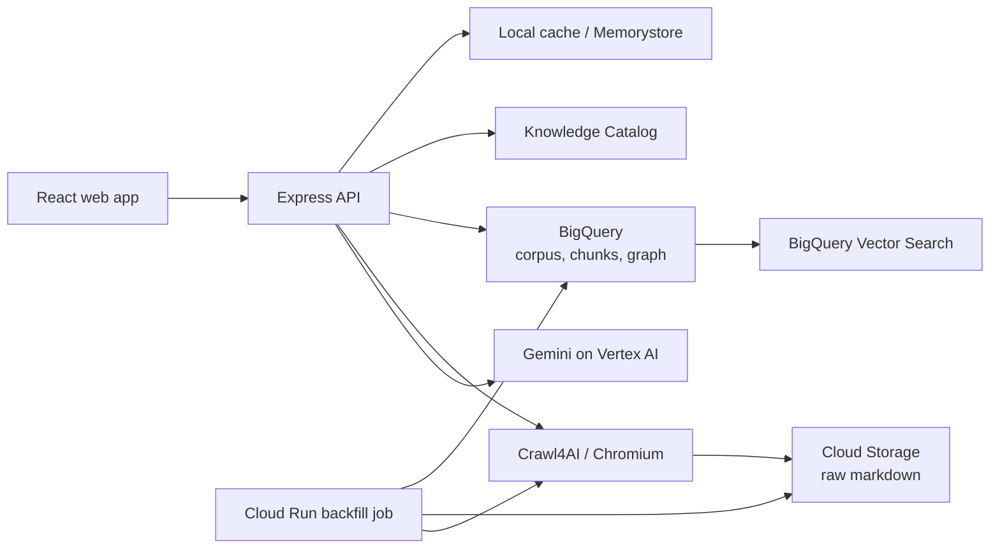

# Mursyid AI

Mursyid AI is a Malay-language Islamic jurisprudence research assistant with grounded answers, source citations, and an interactive knowledge graph. It ingests selected Malaysian Islamic reference portals, stores searchable document chunks and graph relationships in Google Cloud, and uses Gemini on Vertex AI to answer questions from the indexed material.

> [!IMPORTANT]
> This project is a research and information tool, not a substitute for a qualified mufti, scholar, or official fatwa authority. Verify consequential religious decisions against the cited primary source.

## What it includes

- Streaming Malay-language chat grounded in retrieved source passages
- Citations and a relevant graph excerpt attached to each answer
- Interactive D3 knowledge graph with source and relationship details
- Single-URL and batch ingestion through Crawl4AI, with optional Gemini HTML-cleaning fallback
- Incremental indexing based on stable document IDs and content hashes
- BigQuery Vector Search for semantic retrieval
- Cloud Storage snapshots of cleaned source markdown
- Knowledge Catalog entries and metadata-as-code exports
- Session persistence, response feedback, and feedback-review analytics
- Process-local caches, with optional Redis/Memorystore caching across Cloud Run instances
- A staged Cloud Run Job for larger archive backfills

The configured corpus currently covers ten source collections, including JAKIM i-Fiqh, MyHadith, e-Khutbah, four Mufti Wilayah Persekutuan article collections, and selected Malaysian news/religious portals. Source definitions and crawl boundaries live in `server.ts` and `scripts/backfill.ts`.

## Architecture



The app can start without BigQuery, Cloud Storage, or Redis configured and uses bounded in-memory fallbacks where supported. Gemini chat and extraction still require Google Cloud credentials and access to the configured Vertex AI models.

## Tech stack

- React 19, TypeScript, Vite, Tailwind CSS, D3, and Motion
- Express on Node.js 22
- Google Gen AI SDK with Vertex AI and Application Default Credentials (ADC)
- BigQuery, BigQuery Vector Search, Cloud Storage, and Knowledge Catalog
- Crawl4AI with Playwright/Chromium
- Redis or Google Cloud Memorystore (optional)
- Cloud Run, Cloud Build, GitHub Actions, and Terraform

## Local development

### Prerequisites

- Node.js 22 or later
- npm
- A Google Cloud project with billing enabled and access to Vertex AI
- Google Cloud CLI (`gcloud`)
- Python 3 and Crawl4AI only if you want to use the local crawler

### 1. Install the application

```bash
npm install
cp .env.example .env
```

### 2. Authenticate with Google Cloud

This project uses ADC rather than a Gemini API key.

```bash
gcloud auth application-default login
gcloud config set project YOUR_GCP_PROJECT_ID
```

Set at least these values in `.env`:

```dotenv
GCP_PROJECT_ID="YOUR_GCP_PROJECT_ID"
GOOGLE_CLOUD_PROJECT="YOUR_GCP_PROJECT_ID"
GOOGLE_GENAI_USE_ENTERPRISE="true"
GOOGLE_GENAI_USE_VERTEXAI="true"
GEMINI_LOCATION="global"
GOOGLE_CLOUD_LOCATION="global"
```

Model defaults are read from `config.json` and can be overridden with `CHAT_MODEL`, `CRAWLER_MODEL`, and `EXTRACTOR_MODEL`. See `.env.example` for the complete configuration reference.

### 3. Optional: install the local crawler

The production container installs Crawl4AI and its browser automatically. For local ingestion, install it in a virtual environment:

```bash
python3 -m venv .venv
source .venv/bin/activate
pip install -r requirements-crawler.txt
crawl4ai-setup
```

If Crawl4AI is unavailable, ingestion can fall back to Gemini HTML cleaning. Set `CRAWL4AI_FALLBACK_TO_GEMINI="false"` to disable that behavior.

### 4. Start the app

```bash
npm run dev
```

Open [http://localhost:3000](http://localhost:3000).

## Available commands

| Command | Purpose |
| --- | --- |
| `npm run dev` | Run the Express API and Vite development server |
| `npm run lint` | Type-check the TypeScript project |
| `npm run build` | Build the frontend, server bundle, and backfill job |
| `npm start` | Run the production bundle from `dist/server.cjs` |

Before starting the production bundle locally, run `npm run build`.

## Knowledge ingestion

Small/manual ingestion is available from the crawler panel in the web UI. The ingestion pipeline:

1. Crawls and cleans a source into markdown.
2. Skips documents whose content hash has not changed.
3. Stores raw markdown in Cloud Storage when `GCS_RAW_BUCKET` is set.
4. Splits content into chunks and creates Vertex AI embeddings.
5. Extracts knowledge graph nodes and relationships with Gemini.
6. Merges corpus, chunk, and graph rows into BigQuery.
7. Publishes governed metadata to Knowledge Catalog when configured.

The default manual batch settings are intentionally small (`CRAWL_MAX_DEPTH=1` and `CRAWL_MAX_PAGES_PER_SOURCE=3`). They are suitable for smoke tests, not proof of complete archive coverage. See [the crawler quality report](doc/crawl-okf-qc-report.md) for current coverage limitations.

### Large backfills

Production deployments include a `mursyid-ai-backfill` Cloud Run Job. After deployment, run a complete backfill with:

```bash
gcloud run jobs execute mursyid-ai-backfill \
  --region asia-southeast1 \
  --wait
```

For a small smoke run:

```bash
gcloud run jobs execute mursyid-ai-backfill \
  --region asia-southeast1 \
  --update-env-vars BACKFILL_URL_LIMIT=3,BACKFILL_DRY_RUN=false \
  --wait
```

The job discovers URLs through sitemaps, feeds, and bounded traversal, writes sharded JSONL staging data to Cloud Storage, and transactionally merges it into the production BigQuery tables.

## Storage and fallback behavior

| Capability | Production store | Local or unconfigured fallback |
| --- | --- | --- |
| Corpus, embeddings, graph edges | BigQuery | In-memory baseline graph where supported |
| Raw crawled markdown | Cloud Storage | Skipped |
| Session state | Redis via `REDIS_URL` | Bounded in-memory store |
| Response feedback | BigQuery | Local JSONL/in-memory fallback |
| Shared response/retrieval cache | Memorystore/Redis | Process-local TTL/LRU cache |
| Governed metadata | Knowledge Catalog | Metadata-as-code export |

Runtime cache counters are available at `GET /api/cache-status`. Shared caching is enabled only when `SHARED_CACHE_ENABLED=true` and `REDIS_HOST` is configured.

## Deployment

The recommended production path is:

1. Bootstrap Google Cloud resources with Terraform in `infra/`.
2. Deploy from GitHub Actions using Workload Identity Federation.
3. Use the Cloud Run service for the app and the Cloud Run Job for large backfills.

```bash
cd infra
cp terraform.tfvars.example terraform.tfvars
# Edit terraform.tfvars with your project and repository values.
terraform init
terraform plan
terraform apply
```

The Terraform stack provisions the Artifact Registry repository, service accounts and IAM, BigQuery dataset, raw-markdown bucket, GitHub OIDC identity, and—by default—a paid Memorystore instance plus its VPC connector. Set `enable_memorystore = false` if shared Redis caching is not required.

For GitHub Actions, configure these repository variables from the Terraform outputs:

- `GCP_PROJECT_ID`
- `GCP_WORKLOAD_IDENTITY_PROVIDER`
- `GCP_DEPLOY_SERVICE_ACCOUNT`

Optional deployment variables and the legacy manual Cloud Build flow are documented in [doc/cicd.md](doc/cicd.md).

## Key API routes

| Route | Purpose |
| --- | --- |
| `POST /api/chat` | Stream a grounded chat response |
| `GET /api/get-graph` | Return the persisted or fallback graph |
| `POST /api/ingest-url` | Crawl and index a single URL |
| `POST /api/ingest-batch` | Start a bounded batch crawl |
| `GET /api/crawl-sources` | List configured sources and crawl status |
| `GET /api/crawl-logs` | Return current and durable crawl logs |
| `GET /api/cache-status` | Return cache configuration and counters |
| `GET /api/feedback` | Return feedback records and analytics |
| `GET /api/session` | Load the current UI session |

## Project structure

```text
.
├── src/                    React UI and visualizations
├── server.ts               Express API, retrieval, ingestion, and persistence
├── scripts/
│   ├── crawl4ai_bridge.py  Crawl4AI subprocess bridge
│   └── backfill.ts         Large staged backfill job
├── infra/                  Terraform for Google Cloud resources
├── doc/                    Deployment and crawler quality documentation
├── graphify-out/           Generated repository knowledge-graph artifacts
├── cloudbuild.yaml         Manual Cloud Build deployment path
├── Dockerfile              Production app and crawler image
└── .env.example            Runtime configuration reference
```

## Security and data notes

- Do not commit `.env`, service-account keys, Terraform state, or generated credentials.
- Prefer ADC locally and Workload Identity Federation/service accounts in production.
- Ingested websites may have their own access, copyright, and reuse terms; review them before running large crawls.
- Feedback can contain user questions and model answers, so treat the feedback store as potentially sensitive data.

## Further documentation

- [CI/CD and Google Cloud deployment](doc/cicd.md)
- [Crawler and knowledge-population quality report](doc/crawl-okf-qc-report.md)
