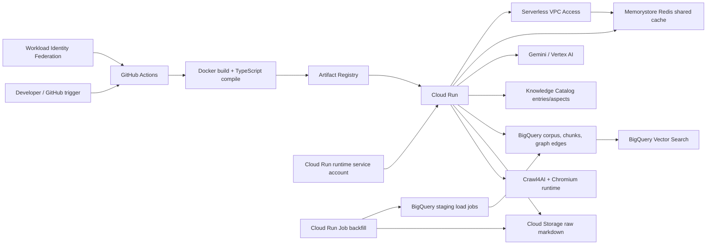

# Mursyid AI: CI/CD & Deployment

This document describes the Google Cloud deployment path for Mursyid AI after the GCP-native knowledge platform migration. Cloud Run still hosts the app, while crawled knowledge is persisted through Cloud Storage, BigQuery, BigQuery Vector Search, and Knowledge Catalog.

## Architecture



## GitHub Actions

`.github/workflows/deploy-cloud-run.yml` is the preferred deployment path. It builds the Docker image with Buildx, reuses GitHub Actions layer caching, pushes both the commit SHA and `latest` tags to Artifact Registry, and deploys the SHA-tagged image to Cloud Run.

The workflow runs on pushes to `main` and can also be started manually from the GitHub Actions tab.

Required GitHub repository variables:

| Variable | Example | Description |
| :--- | :--- | :--- |
| `GCP_PROJECT_ID` | `my-rd-coe-demo-gen-ai` | Google Cloud project. |
| `GCP_WORKLOAD_IDENTITY_PROVIDER` | Terraform output `github_actions_workload_identity_provider` | OIDC provider used by `google-github-actions/auth`. |
| `GCP_DEPLOY_SERVICE_ACCOUNT` | Terraform output `github_actions_deploy_service_account` | Service account GitHub Actions impersonates. |

Optional variables override workflow defaults:

| Variable | Default |
| :--- | :--- |
| `GCP_REGION` | `asia-southeast1` |
| `ARTIFACT_REGISTRY_REPOSITORY` | `mursyid-repo` |
| `CLOUD_RUN_SERVICE` | `mursyid-ai` |
| `CLOUD_RUN_BACKFILL_JOB` | `mursyid-ai-backfill` |
| `GCS_RAW_BUCKET` | `my-rd-coe-demo-gen-ai-mursyid-raw` |
| `GEMINI_LOCATION` | `global` |
| `BQ_DATASET` | `mursyid_knowledge` |
| `BQ_CRAWL_ATTEMPTS_TABLE` | `crawl_attempts` |
| `BACKFILL_MAX_CONCURRENCY` | `4` |
| `BACKFILL_URL_LIMIT` | `0` |
| `BACKFILL_DISCOVERY_DEPTH` | `2` |
| `BACKFILL_PUBLISH_CATALOG` | `true` |
| `CACHE_ENABLED` | `true` |
| `QUERY_NORMALIZATION_ENABLED` | `true` |
| `EMBEDDING_CACHE_TTL_MS` | `86400000` |
| `RETRIEVAL_CACHE_TTL_MS` | `900000` |
| `CHAT_RESPONSE_CACHE_TTL_MS` | `300000` |

Optional Memorystore variables from Terraform outputs:

| Variable | Terraform output | Description |
| :--- | :--- | :--- |
| `MEMORYSTORE_REDIS_HOST` | `memorystore_redis_host` | Private Redis IP used for the shared cache. When set, the workflow deploys `SHARED_CACHE_ENABLED=true`. |
| `MEMORYSTORE_REDIS_PORT` | `memorystore_redis_port` | Redis port, normally `6379`. |
| `SERVERLESS_VPC_CONNECTOR` | `serverless_vpc_connector` | Full connector ID used by `gcloud run deploy --vpc-connector`. |
| `REDIS_CONNECT_TIMEOUT_MS` | n/a | Redis connection timeout for fail-open cache calls. Default: `500`. |

If `MEMORYSTORE_REDIS_HOST` is not set, GitHub Actions still deploys successfully with process-local caching only. If `SERVERLESS_VPC_CONNECTOR` is not set, the workflow omits the Cloud Run VPC connector flags.

To create or update the GitHub OIDC deploy identity, apply Terraform and copy the outputs into GitHub repository variables:

```bash
cd infra
terraform apply
terraform output github_actions_workload_identity_provider
terraform output github_actions_deploy_service_account
terraform output memorystore_redis_host
terraform output memorystore_redis_port
terraform output serverless_vpc_connector
```

For a Redis-backed public deployment, set these GitHub repository variables after `terraform apply`:

```bash
gh variable set MEMORYSTORE_REDIS_HOST --body "$(terraform output -raw memorystore_redis_host)"
gh variable set MEMORYSTORE_REDIS_PORT --body "$(terraform output -raw memorystore_redis_port)"
gh variable set SERVERLESS_VPC_CONNECTOR --body "$(terraform output -raw serverless_vpc_connector)"
```

## Cloud Build (Legacy Manual Path)

`cloudbuild.yaml` builds the Docker image, pushes it to Artifact Registry, deploys the Cloud Run service, and deploys the large-backfill Cloud Run Job definition with production runtime configuration:

- `NODE_ENV=production`
- `GOOGLE_GENAI_USE_ENTERPRISE=true`
- `GOOGLE_GENAI_USE_VERTEXAI=true`
- `GCP_PROJECT_ID`, `GCP_LOCATION`, `GOOGLE_CLOUD_PROJECT`
- `GEMINI_LOCATION`, `GOOGLE_CLOUD_LOCATION`
- `INGESTION_CRAWLER=crawl4ai`
- `BQ_DATASET`, `BQ_CORPUS_TABLE`, `BQ_CHUNKS_TABLE`, `BQ_GRAPH_TABLE`
- `BQ_EMBEDDING_MODEL`
- `GCS_RAW_BUCKET`
- `KNOWLEDGE_CATALOG_ENTRY_GROUP`, `KNOWLEDGE_CATALOG_ENTRY_TYPE`, `KNOWLEDGE_CATALOG_ASPECT_TYPE`
- `MDCODE_EXPORT_DIR=/tmp/catalog-export`

The Cloud Run deployment uses 2 CPU, 4Gi memory, one max instance, always-allocated CPU, and a 900 second timeout so `/api/ingest-batch` can continue background crawling after the request returns. The single-instance cap keeps the current in-memory crawl status stable for small/manual crawls.

Cloud Build also deploys a Cloud Run Job named `mursyid-ai-backfill` for large archive backfills. The job is deployed but not executed automatically.

Run a full staged backfill:

```bash
gcloud run jobs execute mursyid-ai-backfill \
  --region asia-southeast1 \
  --wait
```

Run a constrained smoke backfill:

```bash
gcloud run jobs execute mursyid-ai-backfill \
  --region asia-southeast1 \
  --update-env-vars BACKFILL_URL_LIMIT=3,BACKFILL_DRY_RUN=false \
  --wait
```

The legacy Cloud Build path does not automatically read Terraform outputs. If using Cloud Build instead of GitHub Actions, pass the same Redis env vars and VPC connector flags in `cloudbuild.yaml` or through substitutions.

## Terraform

The Terraform stack enables and provisions:

- Cloud Run and Artifact Registry
- BigQuery dataset for corpus/chunk/graph tables
- Cloud Storage bucket for raw markdown snapshots
- Memorystore Redis, dedicated cache VPC, and Serverless VPC Access connector for shared cache
- Knowledge Catalog / Dataplex API access
- Vertex AI access for Gemini and embeddings through Application Default Credentials (ADC)
- A dedicated Cloud Run runtime service account with BigQuery, Storage, Dataplex, Vertex AI, and VPC Access roles

Gemini does not require a `GEMINI_API_KEY` in this deployment. The app uses the Google Gen AI SDK with `vertexai: true`; Cloud Run authenticates through the runtime service account, and local development should use ADC.

The application creates BigQuery tables and the vector index lazily on startup or first ingestion. Knowledge Catalog custom types are also created lazily on first publish when the runtime service account has sufficient catalog permissions.

## Manual Build

```bash
gcloud builds submit \
  --config=cloudbuild.yaml \
  --project=YOUR_GCP_PROJECT_ID \
  --substitutions=_REGION="asia-southeast1",_VERSION="latest",_GCS_RAW_BUCKET="YOUR_GCP_PROJECT_ID-mursyid-raw"
```

## Key Substitutions

| Variable | Default | Description |
| :--- | :--- | :--- |
| `_REGION` | `asia-southeast1` | Cloud Run, BigQuery, Storage, and Knowledge Catalog region. |
| `_REPOSITORY` | `mursyid-repo` | Artifact Registry repository. |
| `_SERVICE_NAME` | `mursyid-ai` | Cloud Run service name. |
| `_VERSION` | `latest` | Container image tag. |
| `_GEMINI_LOCATION` | `global` | Gemini / Vertex AI model endpoint location. |
| `_BQ_DATASET` | `mursyid_knowledge` | BigQuery dataset for native retrieval stores. |
| `_BQ_CORPUS_TABLE` | `corpus` | Full crawled document table. |
| `_BQ_CHUNKS_TABLE` | `chunks` | Chunk + embedding table used by vector search. |
| `_BQ_GRAPH_TABLE` | `graph_edges` | Extracted graph edge table. |
| `_BQ_CRAWL_RUNS_TABLE` | `crawl_runs` | Durable crawler run/pass records used by the status UI. |
| `_BQ_CRAWL_ATTEMPTS_TABLE` | `crawl_attempts` | Per-URL large-backfill attempt/audit table. |
| `_GCS_RAW_BUCKET` | empty | Cloud Storage bucket for markdown snapshots; set this for production. |
| `_KNOWLEDGE_CATALOG_ENTRY_GROUP` | `mursyid-knowledge` | Custom Knowledge Catalog entry group. |
| `_BACKFILL_JOB_NAME` | `mursyid-ai-backfill` | Cloud Run Job name for staged backfills. |
| `_BACKFILL_MAX_CONCURRENCY` | `4` | Concurrent URL crawl/process workers inside the job. |
| `_BACKFILL_URL_LIMIT` | `0` | Maximum URLs to process; `0` means all discovered URLs. |
| `_BACKFILL_DISCOVERY_DEPTH` | `2` | HTML BFS depth for sources without complete sitemap/RSS coverage. |
| `_BACKFILL_PUBLISH_CATALOG` | `true` | Whether changed/new documents publish Knowledge Catalog entries. |

## Runtime Flow

1. Crawl4AI returns clean markdown documents.
2. Cloud Storage stores raw markdown snapshots when `GCS_RAW_BUCKET` is configured.
3. BigQuery receives corpus rows, chunk embeddings, and extracted graph edges.
4. BigQuery receives crawler run/pass records so `/api/crawl-logs` can recover status after restarts.
5. BigQuery Vector Search retrieves grounded semantic chunks for `/api/chat`.
6. Redis/Memorystore serves shared cache hits for repeated embeddings, retrievals, and exact short-lived chat responses when configured.
7. Knowledge Catalog receives governed source and concept entries with custom aspects.
8. A metadata-as-code export is written to `MDCODE_EXPORT_DIR` for review/debugging.

## Large Backfill Runtime Flow

1. The Cloud Run Job discovers source URLs through sitemaps, RSS feeds, and bounded HTML traversal.
2. Discovery manifests are written to `gs://<GCS_RAW_BUCKET>/backfills/<runId>/discovery/`.
3. Each changed/new document is crawled to raw markdown in `gs://<GCS_RAW_BUCKET>/raw/<source>/<documentId>/<contentHash>.md`.
4. Corpus, chunk, graph, and attempt rows are written as sharded JSONL under `gs://<GCS_RAW_BUCKET>/backfills/<runId>/load/`.
5. BigQuery load jobs write those JSONL shards into run-scoped staging tables.
6. One BigQuery transaction merges staging rows into production tables and deletes obsolete chunks/graph edges for changed documents.
7. `crawl_attempts` records URL-level statuses such as `DISCOVERED`, `SKIPPED_UNCHANGED`, `PREPARED`, `CATALOGED`, and `FAILED`.

## Local ADC Setup

```bash
gcloud auth application-default login
gcloud config set project YOUR_GCP_PROJECT_ID
```

Then set `GCP_PROJECT_ID`, `GOOGLE_CLOUD_PROJECT`, `GOOGLE_GENAI_USE_ENTERPRISE=true`, `GOOGLE_GENAI_USE_VERTEXAI=true`, and `GEMINI_LOCATION=global` in your local environment.
