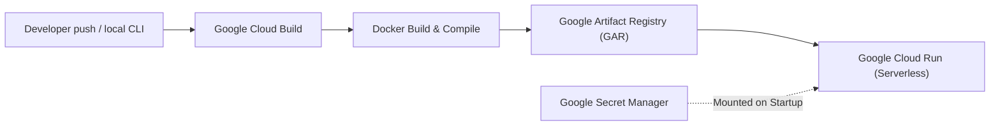

# Mursyid AI: CI/CD & Deployment Documentation

This document describes the continuous integration and continuous deployment (CI/CD) pipeline for **Mursyid AI**. The pipeline compiles the typescript backend and frontend assets, packages them inside a production Docker container, pushes the container image to Google Artifact Registry, and deploys it serverless to Google Cloud Run.

---

## 🏗️ Architecture Overview

The CI/CD pipeline leverages Google Cloud Platform (GCP) native developer tools to achieve high security, isolation, and rapid delivery:



1.  **Orchestrator:** **Google Cloud Build** reads the declarative definition in [cloudbuild.yaml](file:///Users/licheng.phan/Documents/islamic-jurisprudence-agent-&-knowledge-graph/cloudbuild.yaml).
2.  **Artifact Storage:** Built container images are securely pushed to **Google Artifact Registry (GAR)**.
3.  **Hosting Environment:** **Google Cloud Run** serves the container serverless. It auto-scales from $0$ to $N$ instances based on demand, reducing idle cloud computing fees to zero.
4.  **Security (Secrets):** Sensitive credentials (like the `GEMINI_API_KEY`) are fetched securely from **Google Secret Manager** at deployment runtime.

---

## 🛠️ Pipeline Configurations (`cloudbuild.yaml`)

The deployment process is split into three core steps executed sequentially in Cloud Build:

### Step 1: Container Image Construction
Builds a lightweight production-ready Docker container using the [Dockerfile](file:///Users/licheng.phan/Documents/islamic-jurisprudence-agent-&-knowledge-graph/Dockerfile):
```yaml
- name: 'gcr.io/cloud-builders/docker'
  args:
    - 'build'
    - '-t'
    - '${_REGION}-docker.pkg.dev/${PROJECT_ID}/${_REPOSITORY}/${_SERVICE_NAME}:${_VERSION}'
    - '.'
```

### Step 2: Push to Artifact Registry
Pushes the newly built and versioned Docker image to the project's regional Docker repository:
```yaml
- name: 'gcr.io/cloud-builders/docker'
  args:
    - 'push'
    - '${_REGION}-docker.pkg.dev/${PROJECT_ID}/${_REPOSITORY}/${_SERVICE_NAME}:${_VERSION}'
```

### Step 3: Serverless Deployment to Cloud Run
Instructs Google Cloud Run to roll out the container with updated configurations, automatic env mappings, and zero downtime:
```yaml
- name: 'gcr.io/google.com/cloudsdktool/cloud-sdk'
  entrypoint: gcloud
  args:
    - 'run'
    - 'deploy'
    - '${_SERVICE_NAME}'
    - '--image'
    - '${_REGION}-docker.pkg.dev/${PROJECT_ID}/${_REPOSITORY}/${_SERVICE_NAME}:${_VERSION}'
    - '--region'
    - '${_REGION}'
    - '--platform'
    - 'managed'
    - '--allow-unauthenticated'
    - '--port'
    - '3000'
    # Environment Configurations
    - '--set-env-vars'
    - 'NODE_ENV=production,CRAWLER_MODEL=gemini-3.1-flash-lite,CHAT_MODEL=gemini-3.5-flash,EXTRACTOR_MODEL=gemini-3.5-flash'
    # Secrets Mounting
    - '--set-secrets'
    - 'GEMINI_API_KEY=GEMINI_API_KEY:latest'
```

---

## ⚙️ Environment Variables & Secret Management

Configuration variables are decoupled to ensure compliance with Twelve-Factor App methodology:

### 1. Model & Environment Mappings
Passed directly using the `--set-env-vars` flag:
*   `NODE_ENV`: Tells Express and Vite to run in optimized production mode.
*   `CRAWLER_MODEL`: Configured to `gemini-3.1-flash-lite` for cost-optimal and ultra-fast article cleansing.
*   `CHAT_MODEL`: References the low-temperature grounding model (`gemini-3.5-flash`).
*   `EXTRACTOR_MODEL`: References the graph extraction schema model (`gemini-3.5-flash`).
*   `BYPASS_WORKING_HOURS`: Defaults to `true` (unconfigured environment variable defaults to bypass) to keep testing open 24/7. To restrict system availability to Malaysian working hours (Mon-Fri 8 AM - 6 PM), deploy with `BYPASS_WORKING_HOURS=false`.

### 2. Secret Manager Integration
Mounted via the `--set-secrets` flag. This ensures the sensitive Gemini API Token is never committed to GitHub or exposed in plain text. Secret values are injected directly into the instance's environment at the container boundary as `GEMINI_API_KEY`.

---

## 🚀 How to Trigger Deployments

You can trigger builds using manual CLI commands or configure continuous integration via source control triggers.

### Method A: Manual Build & Deploy (GCP CLI)
To deploy your current local workspace changes directly to GCP, execute the following command in the project root:
```bash
gcloud builds submit --config=cloudbuild.yaml --project=my-rd-coe-demo-gen-ai
```

### Method B: Automated Git Triggers (GitHub Integration)
For production setups, you can bind Cloud Build triggers to your GitHub repository:
1.  Navigate to **Cloud Build > Triggers** in the GCP Console.
2.  Connect your GitHub repository: `plc1220/islamic-jurisprudence-agent-knowledge-graph`.
3.  Configure a trigger:
    *   **Event:** Push to a branch.
    *   **Source Branch:** `^main$`
    *   **Configuration:** Cloud Build configuration file (`cloudbuild.yaml`).
4.  Save the trigger. Any commit pushed to the `main` branch will automatically launch a rolling, zero-downtime deployment.

---

## 🔑 Customizing Pipeline Substitutions

You can override default target parameters on manual builds using the `--substitutions` flag:
```bash
gcloud builds submit \
  --config=cloudbuild.yaml \
  --project=my-rd-coe-demo-gen-ai \
  --substitutions=_REGION="us-central1",_VERSION="v1.0.0"
```

| Substitution Variable | Default Value | Description |
| :--- | :--- | :--- |
| `_REGION` | `asia-southeast1` | Deployment region (Singapore is closest to Malaysia for lowest latency). |
| `_REPOSITORY` | `mursyid-repo` | Name of the Google Artifact Registry target repository. |
| `_SERVICE_NAME` | `mursyid-ai` | Name of the Google Cloud Run serverless service. |
| `_VERSION` | `latest` | Image tag versioning reference. |
